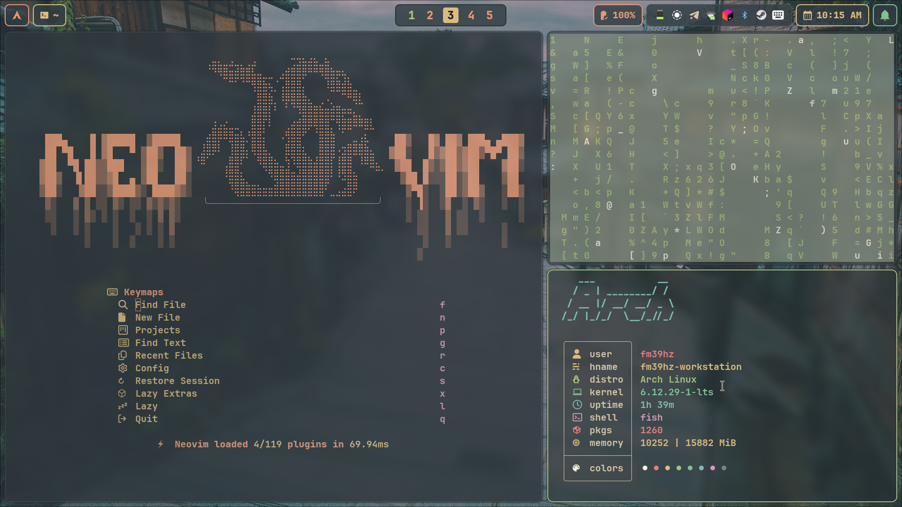
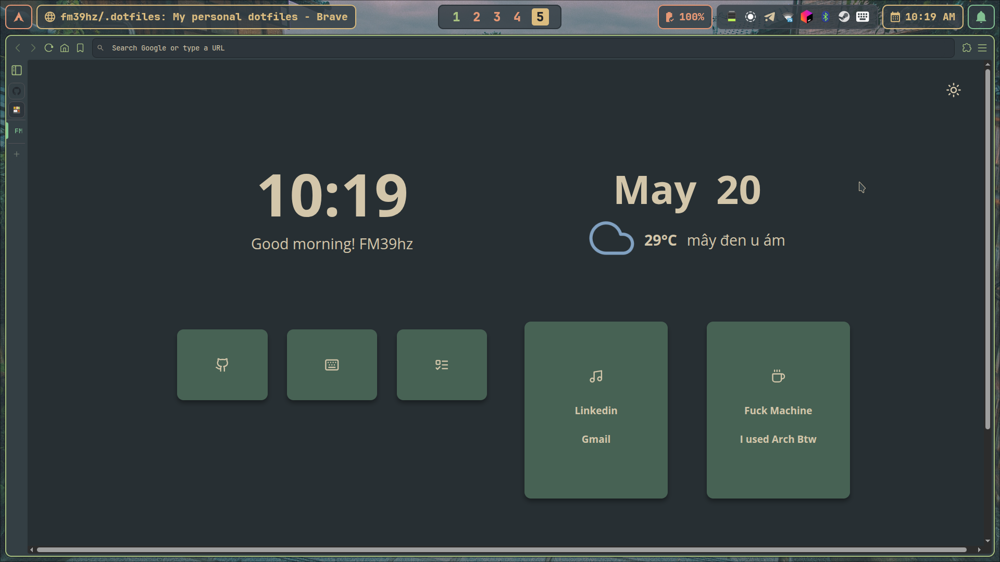

# Overview

- My personal dotfiles
- Enable some of trackpad gesture

## Install

- Install dependencies

```bash
sh -c "$(curl -fsSL https://raw.githubusercontent.com/fm39hz/.dotfiles/main/scripts/install.sh)"
```

- Setup config

```bash
sh -c "$(curl -fsSL https://raw.githubusercontent.com/fm39hz/.dotfiles/main/scripts/setup.sh)"
```

## Screenshot



